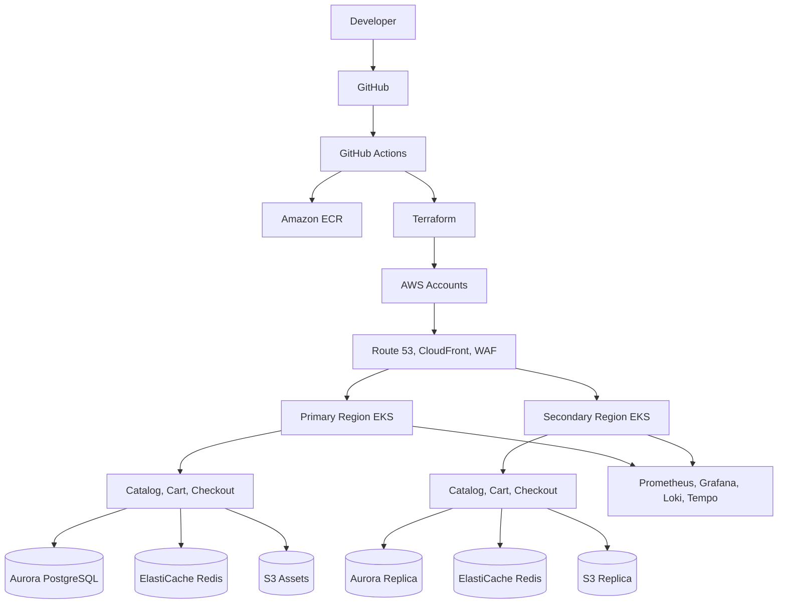

# Enterprise Multi-Region E-Commerce Platform on AWS

Production-oriented reference platform for a multi-region e-commerce system on AWS. The repo combines service code, containers, Terraform, Helm, Argo CD, service mesh policy, observability, CI/CD, and security scanning into one deployable blueprint.

## What Is Included

- Three containerized Python microservices: `catalog`, `cart`, and `checkout`
- Multi-region AWS Terraform layout for VPC, EKS, RDS Aurora, ElastiCache, S3, ECR, WAF, CloudFront, Route 53, IAM, Secrets Manager, and KMS
- Helm chart with autoscaling, pod disruption budgets, network policy, service monitors, canary or blue-green rollout support, and Istio integration
- Argo CD app-of-apps and ApplicationSet templates for GitOps deployment to primary and secondary clusters
- GitHub Actions for tests, Docker builds, Terraform formatting, Helm linting, Trivy scans, SonarQube analysis, and GitOps image promotion
- Observability manifests for Prometheus, Grafana, Loki, Tempo, and OpenTelemetry Collector
- Disaster recovery, security, cost, and operations documentation

## Target Architecture



## Repository Layout

```text
.
|-- ecommerce_platform/          # Shared Python WSGI, health, metrics, tracing runtime
|-- services/                    # Python service route packages
|-- tests/                       # Python unit tests
|-- terraform/
|   |-- envs/                    # Primary, secondary, and global stacks
|   `-- modules/                 # Reusable AWS modules
|-- helm/ecommerce/              # Kubernetes application chart
|-- argocd/                      # GitOps application definitions
|-- kubernetes/                  # Observability Helm values and Grafana dashboards
|-- .github/workflows/           # CI/CD and security automation
`-- docs/                        # Architecture and operations notes
```

## Local Development

```powershell
python -m unittest discover -s tests
$env:SERVICE_NAME = "catalog"
python -m ecommerce_platform.dev_server
curl http://localhost:8080/catalog/items
```

Build a service image:

```bash
docker build --build-arg SERVICE=catalog -t enterprise-commerce-catalog:local .
```

## Deployment Flow

1. Create AWS bootstrap resources for Terraform state and GitHub OIDC roles.
2. Update `terraform/envs/*/*.tfvars.example` into environment-specific `*.tfvars` files.
3. Run the `global` stack first with `enable_edge=false` to create ECR, IAM, Secrets Manager, and budget resources.
4. Run the `primary` and `secondary` regional stacks.
5. Push service images to ECR through GitHub Actions and register both clusters in Argo CD.
6. After regional ingress DNS names exist, rerun the `global` stack with `enable_edge=true`.
7. Apply `argocd/root-application.yaml` to let GitOps own application rollout.

## Production Notes

This repo is deployment-shaped, but real environments still require real inputs: AWS account IDs, backend state bucket, hosted zone ID, ACM certificate ARN, GitHub repo URL, ECR registry annotations, ingress DNS names, secrets, compliance controls, SLOs, load tests, payment integrations, and incident response contacts.
